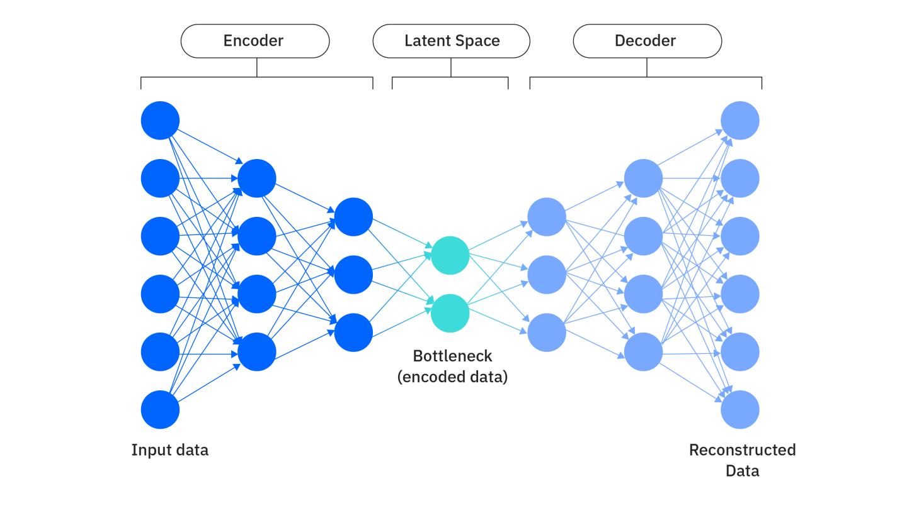

# Autoencoder

## Visão geral

Um autoencoder é um tipo de rede neural artificial usada principalmente para reduzir a dimensionalidade de dados e aprender representações compactas de maneira não supervisionada, ou seja, sem precisar de rótulos.

Em termos simples, ele tenta copiar sua própria entrada na saída, mas é forçado a aprender uma representação comprimida no processo.

### Estrutura

Um autoencoder é dividido em duas partes principais:

<b>Encoder</b>

Pega os dados de entrada (por exemplo, uma imagem, um áudio, etc.) e reduz sua dimensionalidade para uma forma mais compacta chamada espaço latente.

Um espaço latente em aprendizado de máquina é uma representação compactada de pontos de dados que preserva apenas características essenciais que informam a estrutura subjacente dos dados de entrada. A modelagem eficaz do espaço latente é parte integrante do deep learning, incluindo a maioria dos algoritmos de IA generativa.

Exemplo: transformar uma imagem 28×28 (784 pixels) em um vetor de 32 números.

<b>Decoder</b>

Pega o espaço latente e tenta reconstruir a entrada original e quanto melhor a reconstrução, melhor o autoencoder aprendeu a representar os dados.

O treinamento tenta minimizar o erro de reconstrução:

$$L(x, \hat{x}) = \| x - \hat{x} \|^2$$

onde:
- $x$ = dado original
- $\hat{x}$ = dado reconstruído

Assim, a rede aprende a codificar apenas o que é essencial nos dados para reconstruí-los.

### Tipos de Autoencoders

- Vanilla Autoencoder: Possui uma rede totalmente conectada e é usado em dados tabulares simples.
- Convolutional Autoencoder (CAE): Usa convoluções e é excelente para imagens.
- Denoising Autoencoder: Recebe dados com ruído e aprende a reconstruir a versão limpa, o que o torna muito usado para remoção de ruído em imagens e áudio.
- Sparse Autoencoder: Força a rede a usar poucos neurônios ativos no código latente e favorece representações mais interpretáveis.
- Variational Autoencoder (VAE): Não aprende um ponto fixo no espaço latente, mas uma distribuição probabilística e permite gerar novos dados.

### Aplicações comuns

- Redução de dimensionalidade (como alternativa ao PCA)
- Compressão de dados
- Remoção de ruído
- Detecção de anomalias (reconstruções ruins indicam dados fora do padrão)
- Geração de novos exemplos (no caso de VAEs e GANs híbridos)
- Pré-treinamento de redes profundas

## Aplicação

Temos um conjunto de áudios com metadados e surgiu a ideia do Rafael de usar um autoencoder em PyTorch para aprender representações desses áudios, por exemplo, para comparar vozes, agrupar falantes e a reduzir dimensionalidade.

<b>Visão geral do nosso plano</b>

1. Extrair features dos áudios (por exemplo, espectrogramas Mel ou MFCCs)

2. Normalizar e empacotar os dados em um Dataset do PyTorch

3. Treinar um Autoencoder para reconstruir as features

4. Usar o vetor latente (embedding) para análises posteriores (clusterização, classificação, etc).

### Extração das Features

### Extra

https://www.researchgate.net/publication/326918630_Voice_Disorder_Detection_via_an_m-Health_System_Design_and_Results_of_a_Clinical_Study_to_Evaluate_Vox4Health

1. RETIRAR AS MESMAS FEATURES DO TRABALHO DE PARKINSON E TREINE A RANDOMFOREST PARA CLASSIFICAR O GRAU DA DOENÇA
    - F0 MÉDIO
    - DESVIO PADRÃO DO F0
    - JITTER
    - SHIMMER
    - HNR
    - NHR

CALCULAR PARA CADA SINAL E EMPILHAR A, E, I, O, U, KA, PA, TA E TREINAR A ÁRVORE

1. TREINAR UM AUTOENCONDER PARA VOGAL A (COM ACESSO AO ESPAÇO LATENTE)